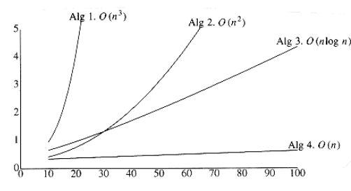

# Chapter 2: Algorithm Analysis

## 2.1 Mathematical Background

Some notation:
* T(n) = O(f(n)): <=
* T(n) = Ω(f(n)): >=
* T(n) = Theta(f(n)): =
* T(n) = o(f(n)): <

Rules 1:
* T1(n) + T2(n) = **max**(O(g(n)), O(f(n)))
* T1(n) * T2(n) = O(g(n)) * O(f(n))

Rules 2:
* an^m + bn^(m - 1) + ... + z = O(n^m)

Typical Growth Rates:

Function | Name
--- | ---
c | Constant
log n | Logarithmic
log^2 n | Log-squared
n | Linear
n log n | n log n
n^2 | Quadratic
n^3 | Cubic
2^n | Exponential

These definition establishes **order** among functions. We compares their **relative rates of growth**

We can always determine the relative growth rates of two functions by computing **limitation**

If T(n) = O(f(n)), we say that f(n) is a _upper bound_ on T(n).

## 2.2 Model

Our model is basically a computer, in which instructions like **addition, multiplication, comparision and assignment**.

Unlike real computers, we assume it **takes exactly one time unit to do anything**.

## 2.3 What to Analyze

We define two functions denoting the **running time**, Tavg(n) and Tworst(n), where n is the **input size**.

Tworst is the worst possible running time for a particular input size.

